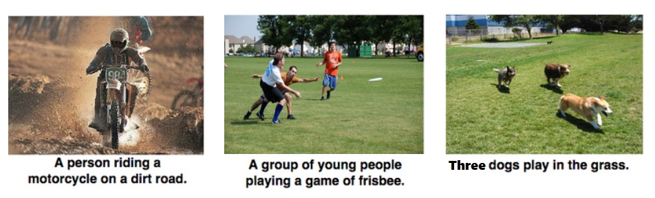
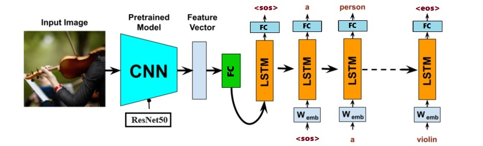
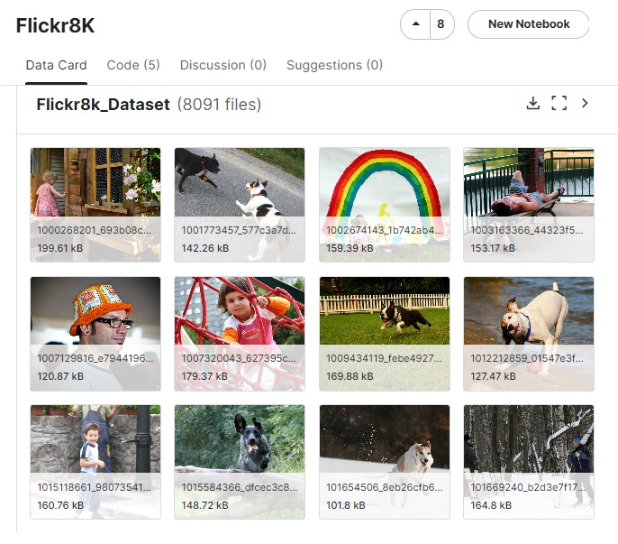

    
<h1 align="center">Image Captioning</h1>

 
## 1. Problem Statement
Image captioning in deep learning is a task that involves generating a textual description of an image. It combines techniques from computer vision and natural language processing to analyze the content of an image and produce a relevant and coherent sentence or paragraph describing it.

The primary goal of the image captioning task is to generate a coherent and accurate textual description of an image. This involves not just identifying objects in the image, but also understanding the relationships between these objects, their actions, and the context of the scene. The resulting captions should be grammatically correct and semantically meaningful.

**Main Challenges in Image Captioning**

- Object Detection and Recognition: Accurately identifying all relevant objects in an image is foundational. However, variations in object appearance, occlusion, and background clutter make this challenging.
- Contextual Understanding: Beyond recognizing individual objects, understanding the scene context and the relationships between objects (e.g., actions, spatial relationships) is crucial.

- Grammar and Syntax: Generating grammatically correct and syntactically sound sentences is essential for coherent descriptions.
- Relevance and Coherence: Ensuring that the generated captions are relevant to the image and maintain a coherent narrative throughout is challenging.

## 2. Related Works
This table shows recent methods used in image captioning, including the deep learning models they use, and links to their papers or GitHub repositories.
 represent a range of approaches and innovations in the field of image captioning, from attention mechanisms to transformer architectures and unified vision-language models.
 

| Date       | Title                                                                 | Description                                                                                                      | Links                                                                                                  |
|------------|-----------------------------------------------------------------------|------------------------------------------------------------------------------------------------------------------|--------------------------------------------------------------------------------------------------------|
| 2016       | Image Captioning with Semantic Attention                              | Combines a CNN (VGG-16) for feature extraction with an LSTM for sequence generation, incorporating attention mechanisms. | [Paper](https://arxiv.org/abs/1603.03925), [GitHub](https://github.com/jazzsaxmafia/show_attend_and_tell.tensorflow) |
| 2017       | Skeleton Key: Image Captioning by Skeleton-Attribute Decomposition    | Uses a CNN (ResNet-50) for feature extraction and an LSTM for caption generation, incorporating skeleton decomposition. | [Paper](https://arxiv.org/abs/1704.06500), [GitHub](https://github.com/klchang/ImageCaptioning)          |
| 2018       | Image Captioning with Object Detection and Attributes                  | Combines object detection and attribute prediction to generate more descriptive and detailed captions.             | [Paper](https://arxiv.org/abs/1803.08379), [GitHub](https://github.com/aimagelab/show-control-and-tell)   |
| 2019       | X-Linear Attention Networks for Image Captioning                       | Introduces X-Linear attention networks to capture higher-order interactions between image regions and words.       | [Paper](https://arxiv.org/abs/1908.07490), [GitHub](https://github.com/JDAI-CV/image-captioning)          |
| 2020       | Show, Attend and Tell: Neural Image Caption Generation with Visual Attention | Uses an encoder-decoder framework with an attention mechanism to focus on different parts of the image.            | [Paper](https://arxiv.org/abs/1502.03044), [GitHub](https://github.com/kelvinxu/arctic-captions)       |
| 2021       | Meshed-Memory Transformer for Image Captioning                         | Utilizes a meshed-memory transformer architecture to enhance the interaction between image regions and words.      | [Paper](https://arxiv.org/abs/1912.08226), [GitHub](https://github.com/aimagelab/meshed-memory-transformer) |

## 3. The Proposed Method

Most Basic Image Captioning systems use an encoder-decoder framework where an image as input is transformed into a feature vector by the encoder and then decoded into a text sequence by the decoder.

- **Encoder (CNN):** This part of the model processes the image. Convolutional Neural Networks (CNNs), such as ResNet or VGG, are typically used to extract feature representations from the image.

- **Decoder (RNN or Transformer):** This part generates the textual description. Recurrent Neural Networks (RNNs), Long Short-Term Memory networks (LSTMs), or Transformer-based models are commonly used to generate the sequence of words that describe the image.

    
<h3 align="center">Model Structure Consists of Encoder and Decoder</h3>

As illustrated in the figure above, this work utilizes ResNet50 as the encoder to extract image features. These features are then concatenated with the caption embeddings and fed into the LSTM layer.

## 4. Implementation
This section delves into the practical aspects of the project's implementation.

### 4.1. Dataset
The Flickr8k dataset is a widely used benchmark for image captioning and related tasks. The dataset is designed for research in image captioning, where the goal is to generate textual descriptions for images. The dataset includes 8,000 images depicting a wide variety of scenes, with a focus on everyday activities and objects.
- Images: The dataset includes 8,000 images depicting a wide variety of scenes, with a focus on everyday activities and objects.

- Captions: Each image is annotated with five different captions, providing a rich set of descriptions. These captions were generated by human annotators and describe the content of the images in natural language. The captions were collected using Amazon Mechanical Turk, where multiple human workers were asked to describe each image. This ensures a diverse and comprehensive set of captions for each image.

    

- Availability: The Flickr8k dataset is freely available for academic and research purposes. It can be downloaded from various sources, including the University of Illinois at Urbana-Champaign [(UIUC)](http://hockenmaier.cs.illinois.edu/8k-pictures.html), and [Kaggle](https://www.kaggle.com/datasets/sayanf/flickr8k).

- Format: The dataset is typically provided in a format that includes the images and several txt files containing the captions and their associated image IDs.
- 
**Important Caption Files**
  - Flickr8k.token: All the image ID's and Captions 
  - Flickr_8k.trainImages: Train part 
  - Flickr_8k.devImages: Validation part
  - Flickr_8k.testImages: Test Part

### 4.2. Model
In this subsection, the architecture and specifics of the deep learning model employed for the image captioning task are presented. Custom model structure is as follow:

    class ImageCaptioning(nn.Module):
    
      def __init__(self, embed_size, hidden_size, vocab_size, num_layers
                   , dropout_embd, dropout_rnn, max_seq_len=20):
        super().__init__()
        self.encoder = EncoderCNN(embed_size)
        self.decoder = DecoderRNN(embed_size, hidden_size, vocab_size, num_layers
                                , dropout_embd, dropout_rnn, max_seq_len=20)
    
      def forward(self, images, captions):
        features = self.encoder(images)
        output = self.decoder(features, captions)
        return output
        
- **EncoderCNN:** This is a custom model that uses a ResNet50 and a fully connected layer to extract features from input image.

- **DecoderRNN:** Here we used a LSTM-based custom model to generate sentence using EncoderCNN output and captions.

### 4.3. Configurations
This part outlines the configuration settings used for training and evaluation. It includes information on hyperparameters, optimization algorithms, loss function, metric, and any other settings that are crucial to the model's performance.

- **Loss:** torch.nn.CrossEntropyLoss(ignore_index=vocabs['<pad>'])

- **Optimizer:** torch.optim.SGD(model.parameters(), lr=lr, weight_decay=wd, momentum=momentum)

- **embed_size** = 300

- device = 'cuda' if torch.cuda.is_available() else 'cpu'

### 4.4. Train
Here, you'll find instructions and code related to the training of the segmentation model. This section covers the process of training the model on the provided dataset.

### 4.5. Evaluate
In the evaluation section, the methods and metrics used to assess the model's performance are detailed. It explains how the model's segmentation results are quantified and provides insights into the model's effectiveness.
